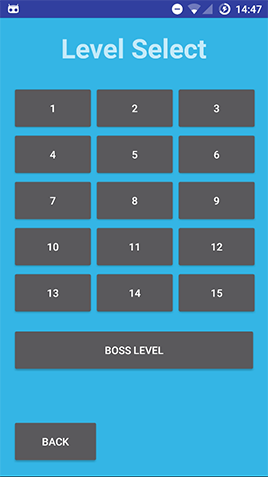

Sokoban puzzle game in which the user must race to complete puzzles 
against an AI player. The AI utilises an adapted version of the A*
algorithm to solve any given level, including randomly generated
levels.

This application was designed and implemented as a part of
a year-long group project.

Contributors: James, Matthew, Alexander, Ibrahim, Haoxiang, Domanic.

| Main menu screen| Level selection screen of story mode      | Game in progress. The slightly transparent character and boxes represent the AI and the AI's boxes, while the opaque character and boxes represent the player and the boxes it can interact with.      |
|------------|-------------|-------------|
|||
