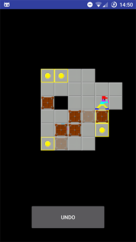

Sokoban puzzle game in which the user must race to complete puzzles 
against an AI player. The AI utilises an adapted version of the A*
algorithm to solve any given level, including randomly generated
levels.

This application was designed and implemented as a part of
a year-long group project.

Contributors: James, Matthew, Alexander, Ibrahim, Haoxiang, Domanic.

| Main menu screen: Inludes playable tutorial and random map generator| Level selection screen: Select different premade levels or boss level   | Game in progress: Semi Transparent player and boxes represent the AI      |
|------------|-------------|-------------|
|||
